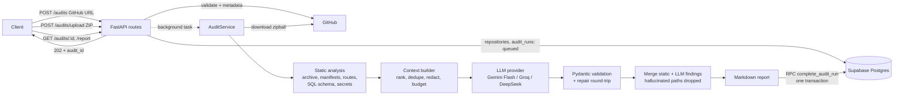

# AI Codebase Audit & Proposal Engine

A FastAPI service that audits codebases generated by AI app builders (Lovable, v0, Bolt). It ingests a public GitHub repository or a ZIP upload, extracts the technical structure, runs deterministic checks plus a review by a cost-effective LLM, stores the run and its itemised findings in Supabase, and returns a client-ready Markdown report for scoping remediation work.

[](https://render.com/deploy?repo=<github-repo-url>)

- **Live API:** `https://<your-service>.onrender.com` (interactive docs at `/docs`)
- **Video walkthrough:** `<link>`
- **Track:** 1 (AI Codebase Audit & Proposal Engine)

---

## 1. Architecture



### Data flow

1. **Intake (inside the request, fast).** The GitHub URL is validated with Pydantic, repository metadata is fetched (one API call), the repository is upserted by its canonical `source_key`, and an `audit_runs` row is created with `status = queued`. Bad input fails immediately with a 4xx. The API answers `202 Accepted` with polling URLs (or runs inline with `?wait=true`).
2. **Download.** The archive is streamed with a hard size cap (default 40 MB) and never buffered past it.
3. **Static analysis (no LLM, deterministic).** The ZIP is read **in memory** (never extracted to disk, which eliminates zip-slip). Build artifacts and dependencies (`node_modules`, `.next`, `dist`, `build`, `.venv`, …), binaries, lockfiles and minified bundles are filtered **before** reading. Then:
   - dependency manifests → framework detection and AI-builder fingerprint (e.g. `lovable-tagger` ⇒ Lovable);
   - API routes: Python via the standard-library **`ast`** module; Next.js (app & pages routers), SvelteKit, Supabase Edge Functions via file conventions; Express/Hono/Fastify via guarded patterns;
   - **SQL migration parser**: tables, PKs, FKs, indexes, RLS statements and policies → *unindexed foreign keys* and *tables without RLS*;
   - Supabase types / Prisma / Drizzle models, and client-side `.from('table')` data-access sites;
   - **secret scanner** that decodes JWT payloads to tell a public Supabase `anon` key from a `service_role` key.
4. **Context building.** Files are ranked by audit value (manifests, schema, auth, routes, data access first; generated `components/ui` last), duplicates are skipped, every detected secret is **redacted** before leaving our infrastructure, and everything is packed into a per-provider character budget.
5. **LLM evaluation.** One call to an OpenAI-compatible endpoint with a JSON Schema generated from the Pydantic model. The reply is validated; on failure the validation errors are sent back for one repair attempt.
6. **Merge and report.** Static and LLM findings are merged and de-duplicated; LLM file paths that don't exist in the repo are discarded; findings are sorted by severity; the Markdown report is rendered.
7. **Persist.** The Postgres function `complete_audit_run` writes all findings and the final run state in **one transaction**. If anything fails, the run is marked `failed` with a reason.

### Code organisation

```
app/
├── main.py              # app factory, lifespan wiring, error handlers
├── config.py            # env-based settings + per-provider presets
├── dependencies.py      # DI helpers, optional API-key guard
├── errors.py            # domain errors carrying HTTP status
├── api/                 # routes only: audits.py, health.py
├── models/              # Pydantic: api.py (I/O), llm.py (LLM schema), enums.py
├── analysis/            # pure, I/O-free analysis
│   ├── archive.py       #   safe ZIP reading + artifact filtering
│   ├── manifests.py     #   deps, frameworks, generator fingerprint
│   ├── routes.py        #   API route extraction (Python AST + JS conventions)
│   ├── db_schema.py     #   SQL/ORM schema analysis, FK-index + RLS checks
│   ├── secrets.py       #   secret detection + redaction
│   ├── checks.py        #   deterministic findings
│   ├── scanner.py       #   orchestrates the above -> ScanResult
│   └── context.py       #   ranks/redacts/packs code for the LLM
├── llm/                 # client.py (retries), structured.py (JSON + repair), prompts.py
├── db/                  # base.py (interface), supabase_repo.py, memory_repo.py, factory.py
└── services/            # audit_service.py (pipeline), github.py, report.py
supabase/migrations/     # raw SQL schema
tests/                   # 29 tests: analysis, LLM layer, GitHub client, API end-to-end
```

Routes never touch Supabase or the LLM directly; services depend on the `AuditRepository` and `LLMClient` interfaces, so tests run the full pipeline against an in-memory repository and a scripted fake LLM.

---

## 2. Local setup

**Fastest path:** `python scripts/bootstrap.py`. It creates the virtualenv, runs the tests, writes `.env` from your answers, verifies the LLM key and Supabase migration with live calls (`scripts/preflight.py`), pushes to GitHub (if the `gh` CLI is installed) and prints your Deploy-to-Render link. The manual steps are below.

**Prerequisites:** Python 3.12+, a free [Gemini API key](https://aistudio.google.com/apikey) (or Groq/DeepSeek/OpenRouter), and optionally a Supabase project.

```bash
git clone <this-repo> && cd ai-codebase-audit
python -m venv .venv && source .venv/bin/activate      # Windows: .venv\Scripts\activate
pip install -r requirements-dev.txt
cp .env.example .env                                   # then fill in the values
```

**Option A, zero-setup demo (no database):** set `DB_BACKEND=memory` and `LLM_API_KEY=...` in `.env`.

**Option B, with Supabase:**
1. Create a project at [supabase.com](https://supabase.com).
2. Open **SQL Editor**, paste `supabase/migrations/20261008000000_init_audit_schema.sql`, and run it (or `supabase db push` with the CLI). The script is idempotent.
3. Copy the Project URL and the **service_role / secret** key (Project Settings → API keys) into `.env`.

Verify the configuration with live calls, then run:

```bash
python scripts/preflight.py      # checks the LLM key and that the Supabase migration is applied
```


```bash
uvicorn app.main:app --reload
# open http://localhost:8000/docs
pytest            # 29 tests, no network or API keys needed
```

### Environment variables

| Variable | Required | Default | Purpose |
|---|---|---|---|
| `LLM_API_KEY` | yes | — | Key for the chosen LLM provider |
| `LLM_PROVIDER` | no | `gemini` | `gemini`, `groq`, `deepseek`, `openrouter` |
| `LLM_MODEL` | no* | per provider | `gemini-2.5-flash`, `openai/gpt-oss-120b`, `deepseek-chat` (*required for OpenRouter) |
| `LLM_CONTEXT_CHAR_BUDGET` | no | per provider | Max prompt size; lower it for Groq's free-tier token limits |
| `DB_BACKEND` | no | `supabase` | `memory` for a local demo without persistence |
| `SUPABASE_URL` | with Supabase | — | Project URL |
| `SUPABASE_SERVICE_ROLE_KEY` | with Supabase | — | Server-side key (never exposed to clients) |
| `API_KEY` | no | — | If set, `/audits` endpoints require header `X-API-Key` |
| `GITHUB_TOKEN` | no | — | Raises GitHub API limit (60 → 5,000/h); enables private repos |
| `MAX_ARCHIVE_MB` / `MAX_FILE_KB` / `MAX_FILES` | no | 40 / 256 / 4000 | Ingestion safety caps |
| `MAX_CONCURRENT_AUDITS` | no | 2 | Concurrency limit (free-tier RAM) |

The full annotated list is in [`.env.example`](.env.example).

---

## 3. API

| Method | Path | Description |
|---|---|---|
| `GET` | `/health` | Liveness; `?deep=true` also pings the database |
| `POST` | `/audits` | Audit a GitHub repo. Body: `{"repo_url": "...", "ref": "optional"}` |
| `POST` | `/audits/upload` | Audit a ZIP (multipart field `file`) |
| `GET` | `/audits` | List audits. Filters: `status`, `repository`, `created_after`, `created_before`, `limit`, `offset` |
| `GET` | `/audits/{id}` | Status, scores, rationale and itemised findings |
| `GET` | `/audits/{id}/report` | Client-ready Markdown (`text/markdown`) |

Both `POST` endpoints accept `?wait=true` to run inline and return the finished audit.

### Examples

```bash
BASE=https://<your-service>.onrender.com          # or http://localhost:8000
KEY="X-API-Key: <API_KEY>"                         # omit if API_KEY is not set

# Submit a GitHub repository (async)
curl -s -X POST "$BASE/audits" -H "$KEY" -H "Content-Type: application/json" \
  -d '{"repo_url": "https://github.com/owner/my-lovable-app"}'
```
```json
{
  "audit_id": "b5c6a7bb-c10a-4626-bac8-7e830df4b813",
  "status": "queued",
  "repository": "owner/my-lovable-app",
  "status_url": "https://<your-service>.onrender.com/audits/b5c6a7bb-...",
  "report_url": "https://<your-service>.onrender.com/audits/b5c6a7bb-.../report"
}
```

```bash
# Upload a ZIP and wait for the result
curl -s -X POST "$BASE/audits/upload?wait=true" -H "$KEY" -F "file=@project.zip"

# Poll status / scores / findings
curl -s "$BASE/audits/<audit_id>" -H "$KEY"

# Client-ready Markdown report
curl -s "$BASE/audits/<audit_id>/report" -H "$KEY" > audit.md

# Completed audits for one repository, newest first
curl -s "$BASE/audits?status=completed&repository=owner/my-lovable-app&limit=10" -H "$KEY"
```

`GET /audits/{id}` (abbreviated; token and timing values are illustrative):

```json
{
  "id": "b5c6a7bb-c10a-4626-bac8-7e830df4b813",
  "status": "completed",
  "repository": {"name": "owner/my-lovable-app", "source_type": "github", "default_branch": "main"},
  "generator": "Lovable",
  "detected_frameworks": ["React", "Vite", "Supabase", "TanStack Query", "Tailwind CSS", "Radix UI / shadcn"],
  "architecture": {"score": 5, "summary": "..."},
  "database": {"score": 4, "summary": "..."},
  "security": {"score": 2, "summary": "..."},
  "remediation_effort": "medium",
  "remediation_rationale": "...",
  "top_priorities": ["Rotate keys", "Enable RLS", "Add FK indexes"],
  "findings_count": 10, "critical_count": 3, "high_count": 1,
  "prompt_tokens": 31250, "completion_tokens": 2890, "duration_ms": 24110,
  "findings": [
    {
      "category": "security", "severity": "critical", "source": "static",
      "title": "Hardcoded secret: Supabase service_role key (bypasses RLS)",
      "description": "A credential matching `supabase_service_role_key` is committed to source control at `src/pages/Admin.tsx:4` (value preview: eyJhbG…[179 chars]). ...",
      "recommendation": "Rotate the credential immediately, move it to server-side environment variables ...",
      "file_path": "src/pages/Admin.tsx", "effort": "low"
    }
  ]
}
```

A full sample report is in [`docs/sample_report.md`](docs/sample_report.md). It was generated from the test fixture, so its LLM-written prose is scripted. The deterministic findings are real output.

---

## 4. Database schema and indexing strategy

The schema lives in [`supabase/migrations/20261008000000_init_audit_schema.sql`](supabase/migrations/20261008000000_init_audit_schema.sql).

```
repositories 1 ──< audit_runs 1 ──< audit_findings
```

| Table | Purpose | Key constraints |
|---|---|---|
| `repositories` | One row per audited source | `UNIQUE (source_key)`: canonical GitHub URL or `zip:<sha256>`, so re-audits reuse the row |
| `audit_runs` | One row per execution: status, scores, rationale, report, token usage, timing | FK → repositories `ON DELETE CASCADE`; scores `CHECK 1..10`; `completed ⇒ report_markdown IS NOT NULL`; `failed ⇒ error_message IS NOT NULL` |
| `audit_findings` | Itemised findings | FK → audit_runs `ON DELETE CASCADE`; enum-typed category/severity/source/effort |

Postgres **enums** constrain values at the database level, and `finding_severity` is declared from `critical` to `info`, so `ORDER BY severity` naturally lists critical first.

### Indexes, and the query each one serves

| Index | Serves |
|---|---|
| `repositories (name text_pattern_ops)` | `GET /audits?repository=owner/repo` (exact) and prefix search `LIKE 'owner/%'` with one btree |
| `UNIQUE repositories (source_key)` | Upsert/deduplication of repositories |
| `audit_runs (status, created_at DESC)` | Latest audits filtered by status: equality column first, then sort column, so no sort step |
| `audit_runs (created_at DESC)` | Latest audits unfiltered, plus `created_after` / `created_before` ranges |
| `audit_runs (repository_id, created_at DESC)` | Indexes the FK (Postgres does **not** auto-index foreign keys; this matters for joins and cascading deletes) **and** serves "audit history for a repo" |
| `audit_runs (created_at) WHERE status IN ('queued','processing')` | **Partial** index for the startup sweep that fails orphaned jobs; it only contains in-flight rows, so it stays tiny |
| `audit_findings (audit_run_id, severity)` | Indexes the FK **and** "findings for an audit, most severe first" |
| `audit_findings (category, severity)` | Cross-audit analytics ("critical security findings this quarter") |

All index plans were verified with `EXPLAIN` on Postgres 16.

### Integrity and security

- **Atomic completion:** `complete_audit_run(uuid, jsonb, jsonb)` updates the run and inserts all findings in one transaction, and refuses to run unless the audit is `processing`. A bad finding rolls everything back, so there are never half-written audits.
- **RLS enabled with no policies:** the public `anon` key can read nothing. The backend uses the `service_role` key server-side only. `EXECUTE` on the RPC is revoked from `anon`/`authenticated`, because Supabase exposes `public` functions to them by default.
- The `audit_run_summaries` view (used for listing) is `security_invoker`, so it respects RLS too.
- Denormalised counts (`findings_count`, `critical_count`, `high_count`) are written once at completion and never change, so list queries need no aggregation.

---

## 5. LLM pipeline

- **Provider-agnostic:** Gemini, Groq, DeepSeek and OpenRouter all speak the OpenAI chat-completions protocol, so one small `httpx` client covers them. Switching is `LLM_PROVIDER=groq`.
- **Structured output:** the JSON Schema in the system prompt is generated from the Pydantic model (`AuditLLMResult`), the same model used to validate the reply, so the contract cannot drift. JSON mode is requested. Validators fix cosmetic quirks (`"High"`, `"7/10"`, `"moderate"`) but reject semantic errors.
- **Repair loop:** on validation failure, the exact Pydantic errors are sent back once; a second failure marks the audit `failed` with the reason.
- **Resilience:** exponential backoff with jitter on 429/5xx/timeouts, honouring `Retry-After`. If a provider rejects an optional parameter (`response_format`, `reasoning_effort`), the request is retried without it.
- **Grounding:** the prompt contains the deterministic analysis plus ranked file excerpts. LLM findings citing files that don't exist are kept, but the bogus path is dropped. Static and LLM findings are labelled (`source`) so the report distinguishes fact from judgement.
- **Privacy:** detected secrets are replaced by `[REDACTED:<kind>]` before any code is sent to a third-party model.

---

## 6. Deployment (Render free tier)

1. Push this repo to GitHub.
2. In Render: **New → Blueprint**, select the repo. `render.yaml` defines the service (Python 3.12, `uvicorn`, health check at `/health`).
3. Fill in the prompted secrets: `SUPABASE_URL`, `SUPABASE_SERVICE_ROLE_KEY`, `LLM_API_KEY`, `API_KEY` (recommended), and optionally `GITHUB_TOKEN`.
4. Once deployed, `curl https://<service>.onrender.com/health?deep=true` should return `"database": "ok"`.

The free tier sleeps after about 15 minutes of inactivity, so the first request after idling takes 30-60 s while it wakes up.

---

## 7. Engineering trade-offs

| Decision | Why | Trade-off |
|---|---|---|
| **Gemini 2.5 Flash default**, Groq/DeepSeek/OpenRouter supported | Free tier with a very large context window, so a meaningful share of a repo fits in one call; quality is good enough for structured review | Free-tier rate limits; provider-specific strict schema modes are not used (portable JSON mode + Pydantic + repair instead) |
| **Hybrid: deterministic checks + LLM** | Secrets, RLS gaps and unindexed FKs are facts; regex/SQL parsing finds them reproducibly and for free. The LLM adds judgement (architecture, auth logic, impact) | Two code paths to maintain; parsers are heuristic, not full SQL/TS grammars |
| **Python `ast` for Python, conventions + patterns for JS/TS** | Zero native dependencies, fast, deploys anywhere | tree-sitter would give exact TS/JSX ASTs; for scoping a quote, the extra precision didn't justify the build complexity |
| **In-memory ZIP reading** | No zip-slip, no temp-file cleanup, artifacts filtered before reading | Archive held in RAM, mitigated by a 40 MB cap and a concurrency limit of 2 |
| **FastAPI `BackgroundTasks`** instead of a queue | No extra infrastructure on a free tier; a startup sweep marks orphaned jobs failed (partial index) | Jobs don't survive restarts and can't scale horizontally. Production would use a queue (Supabase Queues/pgmq, Cloud Tasks, or Celery + Redis) |
| **supabase-py (HTTPS/PostgREST)** instead of a direct Postgres connection | Works over IPv4 from Render with no pooler setup; RLS-aware | No multi-statement transactions from the client, so atomic writes go through an RPC function |
| **Context ranking + per-provider char budget** | Small free-tier limits make *what* we send matter more than *how much* | Very large repos are partially reviewed; the report says how many files were included |
| **Repository interface + in-memory implementation** | The full pipeline is testable without network, keys or a database | A second implementation to keep in sync |

---

## 8. Testing

```bash
pytest -q
```

29 tests cover:
- **Analysis**, using a deliberately flawed Lovable-style fixture: artifact filtering, path traversal, routes, SQL schema (FK indexes, RLS, dollar-quoted bodies, quoted identifiers), JWT classification, redaction and context budgeting.
- **The GitHub client:** URL parsing, rate-limit fallback, archive URL selection and the size cap.
- **The LLM layer:** schema coercion, JSON extraction, the repair loop, and retry/`Retry-After`/parameter fallback (via `httpx.MockTransport`).
- **The API end to end:** sync and async flows, ZIP upload, validation errors, list filters, failure handling, the API-key guard and stale-job recovery.

The SQL migration was also run twice against Postgres 16 (idempotency), and the RPC's rollback behaviour and every index plan were checked with `EXPLAIN`.

## 9. Limitations and next steps

- Replace `BackgroundTasks` with a durable queue, and add webhook callbacks when an audit finishes.
- Map-reduce over very large repos (summarise directories, then audit) instead of a single context window.
- tree-sitter parsing for TS/JSX; read Prisma relations to detect unindexed FKs there too.
- Supabase Auth (JWT) for multi-user access, with per-user RLS policies, instead of a shared API key.
- Cache audits by commit SHA to skip re-auditing unchanged code.
# ai-codebase-audit
